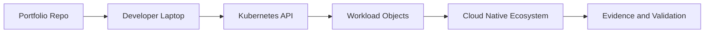

# KCNA - Kubernetes and Cloud Native Associate

## Study Plan Snapshot

- Phase: Phase 1
- Prep Window: Days 10-15 (Exam Day 16)
- Exam Type: Multiple-choice

## Architecture Diagram

## Infographic - Focus Breakdown

| Domain | Weight / Priority |
|---|---|
| Kubernetes Fundamentals | 44% |
| Container Orchestration | 28% |
| Cloud Native Application Delivery | 16% |
| Cloud Native Architecture | 12% |
| Practice Exams | High |

> Note: Domain weights and competencies can change. Re-check the official exam page before booking.

## Hands-On Lab

### Lab Title

Deploy and explain a 3-tier Kubernetes app

### Objective

Demonstrate core Kubernetes primitives and explain architecture decisions clearly.

### Core Tasks

1. Build the baseline environment and document assumptions in `lab-starter/README.md`.
2. Implement the technical controls or workloads in `lab-starter/manifests/` and `lab-starter/scripts/`.
3. Validate end-to-end behavior, including one failure scenario and recovery.
4. Capture commands, outputs, and lessons learned in `lab-starter/notes/`.

### Portfolio Deliverables

- `lab-starter/manifests/3tier-app/`
- `lab-starter/notes/kcna-concept-walkthrough.md`
- `lab-starter/notes/commands.md`
- `lab-starter/notes/results.md`
- `lab-starter/notes/what-i-broke-and-fixed.md`

## Study Sprints

- Sprint 1: Learn domains, tools, and command surface.
- Sprint 2: Build the lab from scratch and capture repeatable steps.
- Sprint 3: Run timed practice and close weak areas.

## Hiring Signal

A reviewer should see that you can plan, implement, troubleshoot, and explain KCNA-level work.

Create one diagram and one plain-language architecture walkthrough aimed at non-experts.
