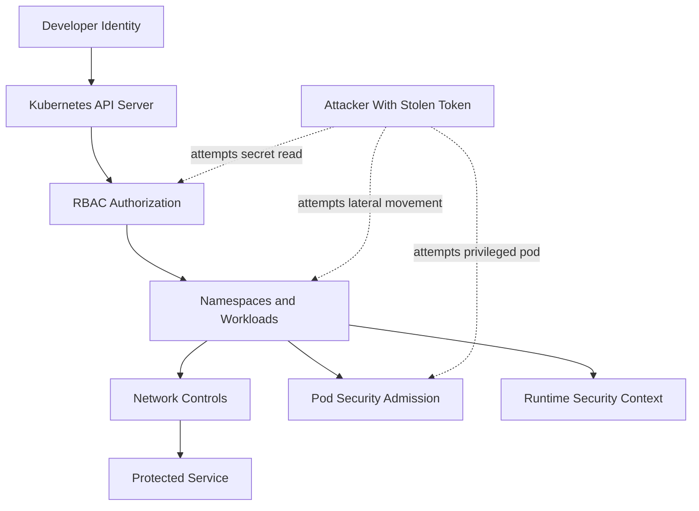

# KCSA Threat Model

```mermaid
flowchart TD
    A[Developer Identity] --> B[Kubernetes API Server]
    B --> C[RBAC Authorization]
    C --> D[Namespaces and Workloads]
    D --> E[Network Controls]
    D --> F[Pod Security Admission]
    D --> G[Runtime Security Context]
    E --> H[Protected Service]

    X[Attacker With Stolen Token] -.attempts lateral movement.-> D
    X -.attempts secret read.-> C
    X -.attempts privileged pod.-> F
```

## Readout

- RBAC stops unauthorized API access.
- Pod Security Admission blocks insecure pod definitions.
- NetworkPolicy limits east-west movement.
