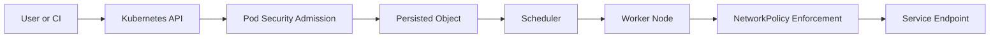

# KCSA Admission and Network Flow

```mermaid
flowchart LR
    U[User or CI] --> API[Kubernetes API]
    API --> PSA[Pod Security Admission]
    PSA --> ETCD[Persisted Object]
    ETCD --> SCHED[Scheduler]
    SCHED --> NODE[Worker Node]
    NODE --> NP[NetworkPolicy Enforcement]
    NP --> SVC[Service Endpoint]
```

## Readout

- Policy gates happen before workload execution.
- Runtime network policy enforces communication boundaries.
