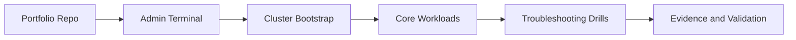

# CKA - Certified Kubernetes Administrator

## Study Plan Snapshot

- Phase: Phase 2
- Prep Window: Days 22-32 (Exam Day 33)
- Exam Type: Performance-based

## Architecture Diagram

## Infographic - Focus Breakdown

| Domain | Weight / Priority |
|---|---|
| Cluster Architecture Installation and Configuration | 25% |
| Services and Networking | 20% |
| Workloads and Scheduling | 15% |
| Troubleshooting | 30% |
| Storage | 10% |

> Note: Domain weights and competencies can change. Re-check the official exam page before booking.

## Hands-On Lab

### Lab Title

Provision and operate a production-style Kubernetes cluster

### Objective

Install, configure, and operate core cluster services with repeatable procedures.

### Core Tasks

1. Build the baseline environment and document assumptions in `lab-starter/README.md`.
2. Implement the technical controls or workloads in `lab-starter/manifests/` and `lab-starter/scripts/`.
3. Validate end-to-end behavior, including one failure scenario and recovery.
4. Capture commands, outputs, and lessons learned in `lab-starter/notes/`.

### Portfolio Deliverables

- `lab-starter/manifests/cluster-ops/`
- `lab-starter/notes/incident-drill.md`
- `lab-starter/notes/commands.md`
- `lab-starter/notes/results.md`
- `lab-starter/notes/what-i-broke-and-fixed.md`

## Study Sprints

- Sprint 1: Learn domains, tools, and command surface.
- Sprint 2: Build the lab from scratch and capture repeatable steps.
- Sprint 3: Run timed practice and close weak areas.

## Hiring Signal

A reviewer should see that you can plan, implement, troubleshoot, and explain CKA-level work.

Run timed recovery drills for DNS, networking, and failing workloads.
