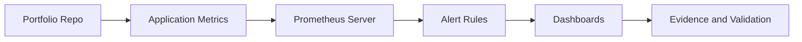

# PCA - Prometheus Certified Associate

## Study Plan Snapshot

- Phase: Phase 3
- Prep Window: Days 52-55 (Exam Day 56)
- Exam Type: Multiple-choice

## Architecture Diagram

## Infographic - Focus Breakdown

| Domain | Weight / Priority |
|---|---|
| Observability Concepts | 18% |
| Prometheus Fundamentals | 20% |
| PromQL | 28% |
| Instrumentation and Exporters | 16% |
| Alerting and Dashboarding | 18% |

> Note: Domain weights and competencies can change. Re-check the official exam page before booking.

## Hands-On Lab

### Lab Title

Build monitoring and alerting for a sample platform

### Objective

Instrument services, write PromQL, and implement actionable alerts.

### Core Tasks

1. Build the baseline environment and document assumptions in `lab-starter/README.md`.
2. Implement the technical controls or workloads in `lab-starter/manifests/` and `lab-starter/scripts/`.
3. Validate end-to-end behavior, including one failure scenario and recovery.
4. Capture commands, outputs, and lessons learned in `lab-starter/notes/`.

### Portfolio Deliverables

- `lab-starter/manifests/prometheus-stack/`
- `lab-starter/notes/promql-playbook.md`
- `lab-starter/notes/commands.md`
- `lab-starter/notes/results.md`
- `lab-starter/notes/what-i-broke-and-fixed.md`

## Study Sprints

- Sprint 1: Learn domains, tools, and command surface.
- Sprint 2: Build the lab from scratch and capture repeatable steps.
- Sprint 3: Run timed practice and close weak areas.

## Hiring Signal

A reviewer should see that you can plan, implement, troubleshoot, and explain PCA-level work.

Include SLO-style alerts and one incident investigation walkthrough.
