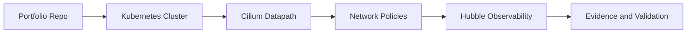

# CCA - Cilium Certified Associate

## Study Plan Snapshot

- Phase: Phase 3
- Prep Window: Days 59-62 (Exam Day 63)
- Exam Type: Multiple-choice

## Architecture Diagram

## Infographic - Focus Breakdown

| Domain | Weight / Priority |
|---|---|
| Architecture | 20% |
| Network Policy | 18% |
| Service Mesh | 16% |
| Network Observability | 10% |
| Installation and Configuration | 10% |
| Cluster Mesh | 10% |
| eBPF | 10% |
| BGP and External Networking | 6% |

> Note: Domain weights and competencies can change. Re-check the official exam page before booking.

## Hands-On Lab

### Lab Title

Implement Cilium networking and policy enforcement

### Objective

Deploy Cilium features for connectivity, security, and observability.

### Core Tasks

1. Build the baseline environment and document assumptions in `lab-starter/README.md`.
2. Implement the technical controls or workloads in `lab-starter/manifests/` and `lab-starter/scripts/`.
3. Validate end-to-end behavior, including one failure scenario and recovery.
4. Capture commands, outputs, and lessons learned in `lab-starter/notes/`.

### Portfolio Deliverables

- `lab-starter/manifests/cilium-lab/`
- `lab-starter/notes/policy-tests.md`
- `lab-starter/notes/commands.md`
- `lab-starter/notes/results.md`
- `lab-starter/notes/what-i-broke-and-fixed.md`

## Study Sprints

- Sprint 1: Learn domains, tools, and command surface.
- Sprint 2: Build the lab from scratch and capture repeatable steps.
- Sprint 3: Run timed practice and close weak areas.

## Hiring Signal

A reviewer should see that you can plan, implement, troubleshoot, and explain CCA-level work.

Add one policy test matrix showing allowed and denied paths.
