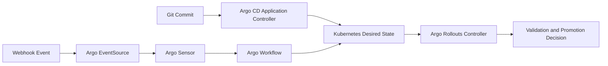

# Argo Control Plane

```mermaid
flowchart LR
    GIT[Git Commit] --> CD[Argo CD Application Controller]
    CD --> K8S[Kubernetes Desired State]
    K8S --> ROL[Argo Rollouts Controller]
    EVT[Webhook Event] --> ES[Argo EventSource]
    ES --> SENS[Argo Sensor]
    SENS --> WF[Argo Workflow]
    WF --> K8S
    ROL --> OBS[Validation and Promotion Decision]
```

## Readout

- GitOps keeps desired state aligned.
- Event paths trigger operational workflows.
- Rollouts introduce controlled risk during change.
