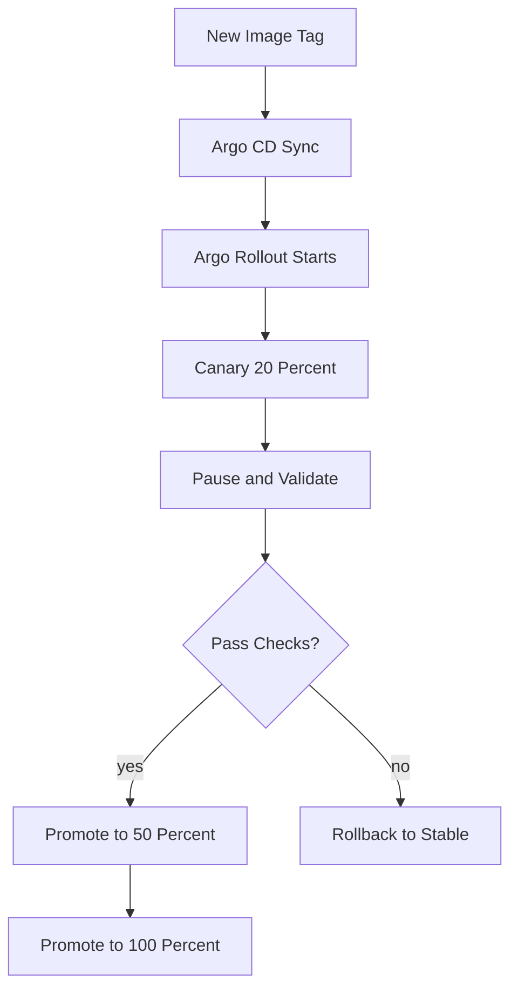

# Progressive Delivery Flow

```mermaid
flowchart TD
    A[New Image Tag] --> B[Argo CD Sync]
    B --> C[Argo Rollout Starts]
    C --> D[Canary 20 Percent]
    D --> E[Pause and Validate]
    E --> F{Pass Checks?}
    F -- yes --> G[Promote to 50 Percent]
    G --> H[Promote to 100 Percent]
    F -- no --> I[Rollback to Stable]
```

## Readout

- Every release step has an explicit decision point.
- Rollback is a first-class path, not an afterthought.
