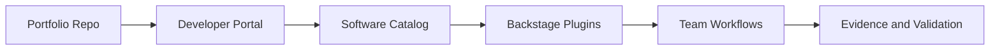

# CBA - Certified Backstage Associate

## Study Plan Snapshot

- Phase: Phase 4
- Prep Window: Days 79-82 (Exam Day 83)
- Exam Type: Multiple-choice

## Architecture Diagram

## Infographic - Focus Breakdown

| Domain | Weight / Priority |
|---|---|
| Backstage Development Workflow | 24% |
| Backstage Infrastructure | 22% |
| Backstage Catalog | 22% |
| Customizing Backstage | 32% |
| Platform Adoption Story | High |

> Note: Domain weights and competencies can change. Re-check the official exam page before booking.

## Hands-On Lab

### Lab Title

Stand up and customize an internal developer portal

### Objective

Deploy Backstage, register services, and customize plugins for developer self-service.

### Core Tasks

1. Build the baseline environment and document assumptions in `lab-starter/README.md`.
2. Implement the technical controls or workloads in `lab-starter/manifests/` and `lab-starter/scripts/`.
3. Validate end-to-end behavior, including one failure scenario and recovery.
4. Capture commands, outputs, and lessons learned in `lab-starter/notes/`.

### Portfolio Deliverables

- `lab-starter/manifests/backstage-portal/`
- `lab-starter/notes/catalog-governance.md`
- `lab-starter/notes/commands.md`
- `lab-starter/notes/results.md`
- `lab-starter/notes/what-i-broke-and-fixed.md`

## Study Sprints

- Sprint 1: Learn domains, tools, and command surface.
- Sprint 2: Build the lab from scratch and capture repeatable steps.
- Sprint 3: Run timed practice and close weak areas.

## Hiring Signal

A reviewer should see that you can plan, implement, troubleshoot, and explain CBA-level work.

Document how the portal improves onboarding time and discoverability.
