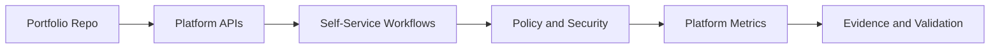

# CNPA - Certified Cloud Native Platform Engineering Associate

## Study Plan Snapshot

- Phase: Phase 4
- Prep Window: Days 82-85 (Exam Day 86)
- Exam Type: Multiple-choice

## Architecture Diagram

## Infographic - Focus Breakdown

| Domain | Weight / Priority |
|---|---|
| Platform Engineering Core Fundamentals | 36% |
| Observability Security and Conformance | 20% |
| Continuous Delivery and Platform Engineering | 16% |
| Platform APIs and Provisioning Infrastructure | 12% |
| IDPs and Developer Experience | 8% |
| Measuring your Platform | 8% |

> Note: Domain weights and competencies can change. Re-check the official exam page before booking.

## Hands-On Lab

### Lab Title

Design a foundational internal developer platform

### Objective

Model platform capabilities, delivery workflows, security, and platform KPIs.

### Core Tasks

1. Build the baseline environment and document assumptions in `lab-starter/README.md`.
2. Implement the technical controls or workloads in `lab-starter/manifests/` and `lab-starter/scripts/`.
3. Validate end-to-end behavior, including one failure scenario and recovery.
4. Capture commands, outputs, and lessons learned in `lab-starter/notes/`.

### Portfolio Deliverables

- `lab-starter/manifests/cnpa-platform/`
- `lab-starter/notes/platform-kpis.md`
- `lab-starter/notes/commands.md`
- `lab-starter/notes/results.md`
- `lab-starter/notes/what-i-broke-and-fixed.md`

## Study Sprints

- Sprint 1: Learn domains, tools, and command surface.
- Sprint 2: Build the lab from scratch and capture repeatable steps.
- Sprint 3: Run timed practice and close weak areas.

## Hiring Signal

A reviewer should see that you can plan, implement, troubleshoot, and explain CNPA-level work.

Capture DORA metrics baseline and expected improvement targets.
