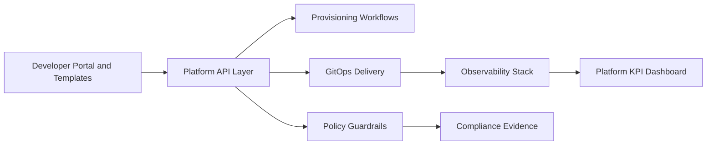

# CNPA Platform Capabilities Map

```mermaid
flowchart LR
    IDP[Developer Portal and Templates] --> API[Platform API Layer]
    API --> PROV[Provisioning Workflows]
    API --> DELIV[GitOps Delivery]
    API --> POL[Policy Guardrails]
    DELIV --> OBS[Observability Stack]
    POL --> COMP[Compliance Evidence]
    OBS --> KPI[Platform KPI Dashboard]
```

## Readout

- Platform capabilities are exposed as product interfaces.
- Observability and policy evidence are built in from day one.
