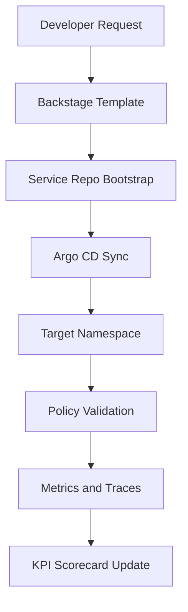

# CNPA Self-Service Request Flow

```mermaid
flowchart TD
    Dev[Developer Request] --> Temp[Backstage Template]
    Temp --> Repo[Service Repo Bootstrap]
    Repo --> GitOps[Argo CD Sync]
    GitOps --> Env[Target Namespace]
    Env --> Policy[Policy Validation]
    Policy --> Obs[Metrics and Traces]
    Obs --> Score[KPI Scorecard Update]
```

## Readout

- Self-service is validated by policy before deployment.
- The platform updates KPIs as part of normal workflow.
