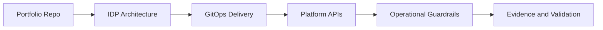

# CNPE - Certified Cloud Native Platform Engineer

## Study Plan Snapshot

- Phase: Phase 4
- Prep Window: Days 84-88 (Exam Day 89)
- Exam Type: Performance-based

## Architecture Diagram

## Infographic - Focus Breakdown

| Domain | Weight / Priority |
|---|---|
| Platform Architecture and Infrastructure | 15% |
| GitOps and Continuous Delivery | 25% |
| Platform APIs and Self-Service Capabilities | 25% |
| Observability and Operations | 20% |
| Security and Policy Enforcement | 15% |

> Note: Domain weights and competencies can change. Re-check the official exam page before booking.

## Hands-On Lab

### Lab Title

Build and operate an enterprise-grade platform engineering stack

### Objective

Deliver a secure self-service platform with GitOps, policy, and observability controls.

### Core Tasks

1. Build the baseline environment and document assumptions in `lab-starter/README.md`.
2. Implement the technical controls or workloads in `lab-starter/manifests/` and `lab-starter/scripts/`.
3. Validate end-to-end behavior, including one failure scenario and recovery.
4. Capture commands, outputs, and lessons learned in `lab-starter/notes/`.

### Portfolio Deliverables

- `lab-starter/manifests/cnpe-platform/`
- `lab-starter/notes/capstone-runbook.md`
- `lab-starter/notes/commands.md`
- `lab-starter/notes/results.md`
- `lab-starter/notes/what-i-broke-and-fixed.md`

## Study Sprints

- Sprint 1: Learn domains, tools, and command surface.
- Sprint 2: Build the lab from scratch and capture repeatable steps.
- Sprint 3: Run timed practice and close weak areas.

## Hiring Signal

A reviewer should see that you can plan, implement, troubleshoot, and explain CNPE-level work.

Treat this as your public capstone and include a full operations runbook.
