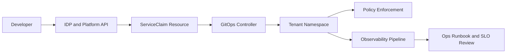

# CNPE Capstone Architecture

## Readout

- Platform API is the front door for self-service.
- GitOps applies desired state and policy enforces boundaries.
- Observability closes the operations feedback loop.
