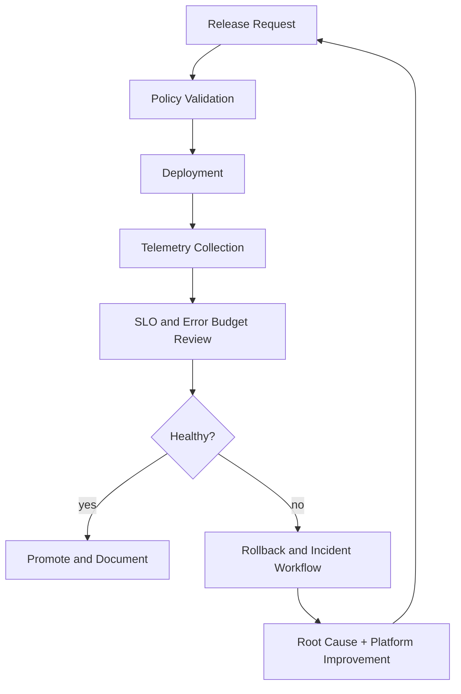

# CNPE Operations Feedback Loop

```mermaid
flowchart TD
    A[Release Request] --> B[Policy Validation]
    B --> C[Deployment]
    C --> D[Telemetry Collection]
    D --> E[SLO and Error Budget Review]
    E --> F{Healthy?}
    F -- yes --> G[Promote and Document]
    F -- no --> H[Rollback and Incident Workflow]
    H --> I[Root Cause + Platform Improvement]
    I --> A
```

## Readout

- Reliability and governance are continuous loops.
- Incident learning feeds back into platform product changes.
