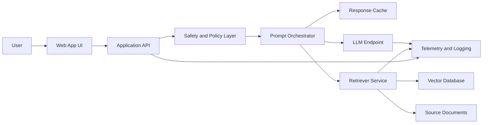
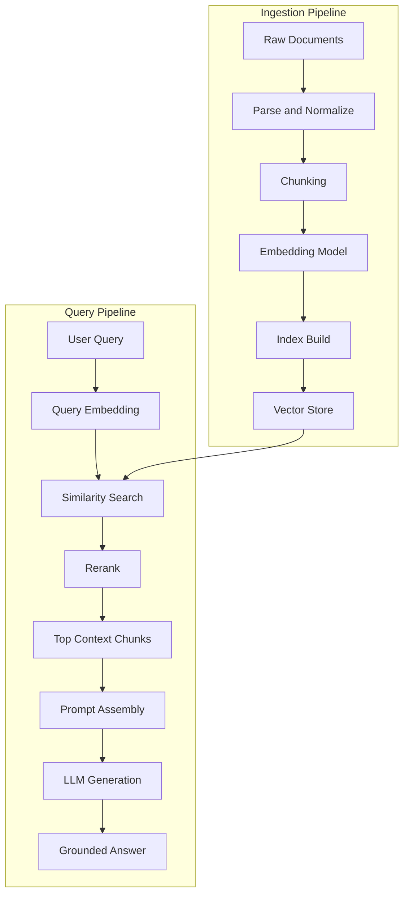
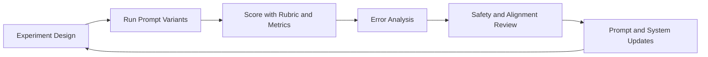

# NCA-GENL Architecture Diagrams

## 1) Enterprise LLM App Reference Architecture

Study target:

- Explain where latency is introduced.
- Explain where safety controls should run.
- Explain how retrieval grounds model output.

## 2) RAG Ingestion and Query Flow

Study target:

- Compare chunk-size tradeoffs.
- Explain top-k retrieval effects.
- Describe why reranking can improve answer quality.

## 3) Experimentation and Trustworthy AI Loop

Study target:

- Define measurable success criteria.
- Separate quality failures from safety failures.
- Show how an iterative loop improves reliability.
