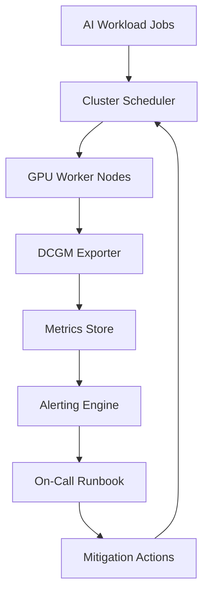
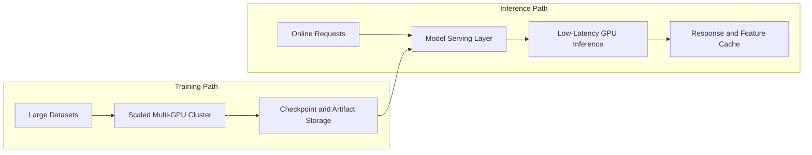
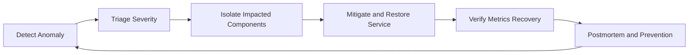

# NCA-AIIO Architecture Diagrams

## 1) AI Infrastructure Stack (Physical to Workload)

```mermaid
flowchart LR
    apps["AI Applications"] --> platform["Orchestration and Scheduling"]
    platform --> runtime["Container Runtime and Tooling"]
    runtime --> drivers["NVIDIA Drivers and CUDA Stack"]
    drivers --> gpu["GPU Compute Resources"]
    gpu --> interconnect["High-Speed Interconnect"]
    interconnect --> storage["High-Throughput Storage"]
    storage --> facility["Power and Cooling Facilities"]
```

Study target:

- Explain each layer and one failure mode at that layer.
- Explain why operations teams need visibility across all layers.

## 2) Cluster Operations and Observability Flow

Study target:

- Describe how telemetry becomes actionable operations.
- Describe what alerts should trigger immediate escalation.

## 3) Training vs Inference Infrastructure Pattern

Study target:

- Compare throughput priorities for training vs latency priorities for inference.
- Identify where capacity planning differs between the two.

## 4) Incident Response Lifecycle for AI Ops

Study target:

- Know the order and purpose of each phase.
- Distinguish operational mitigation from root-cause prevention.
